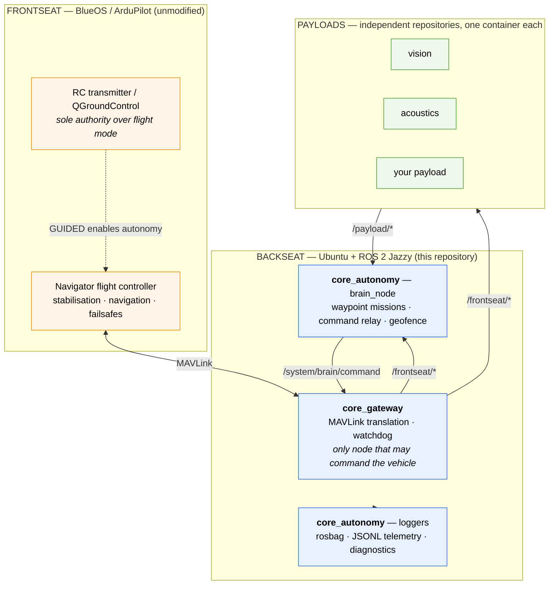

# BlueBoat Core

A minimal, open-source ROS 2 foundation for adding autonomy to the [Blue Robotics BlueBoat](https://bluerobotics.com/store/rovs-components/blueboat/) autonomous surface vehicle.

BlueBoat Core adds a **backseat computer** to a stock BlueBoat: a second embedded computer running ROS 2, while the vehicle's own BlueOS/ArduPilot **frontseat** keeps doing what it does well — stabilisation, navigation, manual control and hardware failsafes. A single MAVLink gateway joins the two, and nothing in the backseat can command the vehicle except through it.

It is deliberately small. You get waypoint missions, a safety envelope, logging, monitoring, a simulator, and a payload mechanism for your own code — and not much else. It is a foundation to build on, not a finished autonomy suite.

> Developed by the BLUE Lab at the Institut de Ciències del Mar (ICM-CSIC), Barcelona. It accompanies the OCEANS 2026 Monterey paper *An adaptive open-source architecture for enhanced autonomy in BlueBoat ASVs based on ROS2*. If you use it in your research, please [cite the paper](#citation).

📚 **[Documentation](https://bluelab-icm.mintlify.site)** · 🧩 **[Payload template](https://github.com/BlueLab-ICM/blueboat-payload-template)**

---

## Why a backseat computer

Off the shelf, the BlueBoat is a remotely operated vehicle: WiFi range, waypoint navigation, an operator watching a screen. That is enough for a bounded survey and not enough for a mission that has to decide something on its own.

The obvious fix — putting research code into the autopilot — is the wrong one. Autopilot firmware is where vehicle safety lives, and experimental code does not belong there.

The frontseat/backseat split keeps the two apart:

- The **frontseat** — a Navigator flight controller and a Raspberry Pi running BlueOS and ArduPilot — owns stabilisation, navigation, manual control and failsafes. It is unmodified.
- The **backseat** — a Raspberry Pi 5 or NVIDIA Jetson Orin Nano running Ubuntu and ROS 2 Jazzy — owns mission logic and research code. It is where this repository runs.

Autonomy is therefore an *addition*, never a replacement. Flip the RC transmitter out of GUIDED and the backseat is instantly powerless, whatever it was doing.

## Architecture



Four properties carry the design:

**One gateway, one authority.** `gateway_node` is the only node holding a MAVLink connection. It rejects any command whose `source_node` is not `core_autonomy`, so a payload can see the command topic but cannot use it.

**The backseat never sets the flight mode.** ArduPilot's mode comes from the operator, over RC or the ground station. The gateway reads it from telemetry and refuses to forward anything unless the vehicle is already in GUIDED.

**A watchdog, not a hope.** The brain heartbeats at 10 Hz. Two seconds of silence and the gateway revokes the autonomy lease, leaving the autopilot to hold the vehicle until the operator takes over.

**Payloads are isolated.** Each lives in its own repository and container, talking only over ROS 2 topics. A payload that crashes, wedges or floods the CPU cannot take the autonomy with it.

## What the brain does

One parameter, `control_source`, selects what drives the boat:

| `control_source` | Behaviour |
|------------------|-----------|
| `mission` | Fly a waypoint list from a JSON file, then stop. Survey work with no code to write. |
| `payload_waypoint` | Relay position targets a payload publishes on `/payload/waypoints/waypoint`. |
| `payload_velocity` | Relay velocity targets a payload publishes on `/payload/cmd_vel`. |

All three get the same protections, applied every control cycle:

- **Explicit enable** — relaying is off until an operator calls `/system/enable_autonomy`, and GUIDED alone is not enough.
- **Geofence** — a circular boundary; targets outside it are refused and relaying stops if the boat leaves it.
- **Staleness** — a payload that stops publishing stops the boat, instead of leaving its last command latched.
- **Lease keepalive** — a 10 Hz heartbeat the gateway watchdog depends on.

That is the whole of the autonomy layer. Anything more sophisticated belongs in a payload, which inherits all of it for free.

## Quick start

### In simulation, on your laptop

No vehicle and no autopilot hardware. You need Docker and about 20 GB of disk; the first run compiles ArduPilot and takes 15-30 minutes.

```bash
git clone https://github.com/BlueLab-ICM/blueboat-core-public.git
cd blueboat-core-public

# ArduPilot SITL + gateway + brain + Foxglove bridge
docker compose -f deployment/docker-compose.yml \
               -f deployment/docker-compose.sitl.yml up -d --build

# Stand in for the RC transmitter and hand over control
./scripts/sim-set-mode.py GUIDED

# Choose a mission and start it
docker exec core_autonomy bash -c "source /opt/ros/jazzy/setup.bash && \
  ros2 param set --no-daemon /brain_node waypoint_file deployment/waypoints/lawnmower_survey.json && \
  ros2 service call /system/enable_autonomy std_srvs/srv/SetBool '{data: true}'"
```

Watch it with `docker logs -f core_autonomy`, or connect [Foxglove](https://app.foxglove.dev) to `ws://localhost:8765` to see the geofence, the waypoints and the boat move.

<details>
<summary>If the build fails with <code>Could not resolve host: github.com</code></summary>

Docker BuildKit isolates the build from the host's DNS on some systems:

```bash
docker build --network=host -f deployment/Dockerfile.sitl -t blueboat-sitl .
```
</details>

### On a vehicle

The backseat computer needs Docker, a static IP on the BlueBoat's onboard network, and a MAVLink endpoint in BlueOS pointing at it. The [hardware guide](https://bluelab-icm.mintlify.site/hardware/backseat-computer) covers wiring, relay power control and networking.

```bash
docker compose -f deployment/docker-compose.yml up -d --build
```

Then select GUIDED on the RC transmitter and enable autonomy as above.

Stop everything with `docker compose -f deployment/docker-compose.yml down`.

## Waypoint missions

Generate a pattern:

```bash
./scripts/generate-waypoints.py lawnmower --lat 41.3626 --lon 2.1862 \
    --width 80 --height 60 --spacing 15 -o deployment/waypoints/survey.json
```

```
Wrote 12 waypoints to deployment/waypoints/survey.json
Furthest point is 50.0 m from the centre — set the brain's geofence_radius_m
above this, or the mission will be refused.
```

Two patterns ship: `lawnmower` for uniform coverage of a rectangle, and `spiral` for searching outward from a believed position. Any JSON file with `latitude`/`longitude` entries works, so output from another planner usually loads unmodified.

The brain refuses to start a mission whose waypoints fall outside the geofence, rather than starting it and aborting halfway through a survey.

## Building your own autonomy

The two `payload_*` sources exist so you never have to modify this repository. Your code lives in its own repository, generated from the [payload template](https://github.com/BlueLab-ICM/blueboat-payload-template), runs in its own container, and steers the boat by publishing one topic:

```python
target = NavSatFix()
target.latitude, target.longitude = self.next_sample_location()
self.waypoint_pub.publish(target)   # /payload/waypoints/waypoint
```

Set `control_source` to `payload_waypoint` and the brain applies the geofence and the staleness check on your behalf. Your algorithm cannot drive the boat out of the survey area, and if it dies the boat stops rather than continuing on its last instruction.

The [adding a payload guide](https://bluelab-icm.mintlify.site/guides/adding-a-payload) works through a complete example.

## Monitoring and data

```
data/
├── rosbags/     complete MCAP recording of every topic (--profile record)
└── telemetry/   JSONL: position, heading, speed, battery, status at 5 Hz
```

The rosbag is the full replayable record; the JSONL is the flat, analysis-ready summary:

```python
import pandas as pd
df = pd.read_json('data/telemetry/telemetry_20260817_142312.jsonl', lines=True)
```

Live, the stack publishes system diagnostics on `/diagnostics`, container resource usage on `/system/container_stats`, and geofence and waypoint geometry as visualisation markers. A Foxglove bridge serves all of it over WebSocket; a Zenoh bridge (`--profile remote`) carries it over cellular to a remote dashboard.

## Repository layout

```
src/core/core_gateway/      MAVLink bridge and safety watchdog
src/core/core_autonomy/     Waypoint missions, command relay, diagnostics, logging
src/interfaces/             Shared message definitions
deployment/                 Dockerfiles, compose files, waypoint patterns
scripts/                    Payload management, waypoint generation, simulation helper
tests/                      Geometry and waypoint tests
docs/                       Documentation site sources
```

## Related repositories

| Repository | Purpose |
|------------|---------|
| [blueboat-core-public](https://github.com/BlueLab-ICM/blueboat-core-public) | This repository: the core autonomy foundation. |
| [blueboat-payload-template](https://github.com/BlueLab-ICM/blueboat-payload-template) | Template for building your own payload. Start here to add a sensor or an algorithm. |

## Citation

```bibtex
@inproceedings{masmitja2026blueboat,
  title     = {An adaptive open-source architecture for enhanced autonomy
               in {BlueBoat} {ASVs} based on {ROS2}},
  author    = {Masmitja, Ivan and Somers, Korneel and Agundez, Pedro and
               Pradell, Roc and Bardaji, Raul and Carandell, Matias and
               Aguzzi, Jacopo and Gomariz, Spartacus},
  booktitle = {OCEANS 2026 Monterey},
  year      = {2026}
}
```

## Acknowledgements

This work acknowledges the Spanish Ministerio de Ciencia, Innovación y Universidades (TECTUGA: PID2024-161772OA-I00), and is part of DIGI4ECO (European Union's Horizon Europe programme, No 101112883), SUN-BIO (GAP-101157493) and MERLIN (GAP-01189796). It acknowledges the 'Severo Ochoa Centre of Excellence' accreditation (CEX2024-001494-S) from AEI 10.13039/501100011033, and the Research Unit Tecnoterra (ICM-CSIC/UPC).

The authors thank the Facultat de Nàutica de Barcelona (UPC) for access to the Espai Vela facilities, and the Oceanographic Engineering Service and the BLUE Lab of the Institut de Ciències del Mar (ICM-CSIC) for their continued technical support.

## License

Released under the [MIT License](LICENSE).
