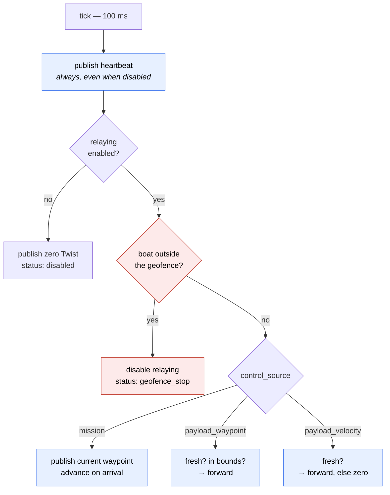

`brain_node` decides where the boat goes. It is the only node that publishes commands the gateway will accept, and its whole job is to produce at most one command per control cycle — or refuse to.

Source: [`src/core/core_autonomy/core_autonomy/brain_node.py`](https://github.com/BlueLab-ICM/blueboat-core-public/blob/main/src/core/core_autonomy/core_autonomy/brain_node.py)

## Three control sources

One parameter, `control_source`, selects what drives the boat. Exactly one at a time — forwarding a position target and a velocity target together would hand the autopilot two conflicting instructions.

<CardGroup cols={3}>
  <Card title="mission" icon="route">
    Fly a waypoint list from a JSON file, then stop.

    Survey work with no code to write.
  </Card>
  <Card title="payload_waypoint" icon="location-dot">
    Relay `NavSatFix` targets from `/payload/waypoints/waypoint`.

    Your algorithm decides where.
  </Card>
  <Card title="payload_velocity" icon="gauge-high">
    Relay `Twist` from `/payload/cmd_vel`.

    For tight control loops.
  </Card>
</CardGroup>

There is deliberately no arbitration, no priority scheme and no blending. Nothing in the code has to answer "which of these two commands wins", because two commands never exist at once.

## The control loop

Everything happens on one 10 Hz timer, in a fixed order:



Safety is evaluated before control, every tick, in every mode. A new control source cannot forget to check the geofence, because it never gets the chance to run if the geofence is violated.

The 10 Hz rate is set by the gateway's two-second lease timeout: fast enough that a few dropped ticks cannot revoke the lease, slow enough that the executor is never the bottleneck.

<Note>
The heartbeat is published **before** the enable check and regardless of it. The lease is about liveness, not intent — the gateway needs to know the brain is alive even while it is deliberately doing nothing. The heartbeat's `string_param` carries `ENABLED` or `DISABLED`, which is what the gateway uses to decide whether to request arming.
</Note>

## Enabling

Relaying is off until an operator turns it on:

```bash
ros2 service call /system/enable_autonomy std_srvs/srv/SetBool "{data: true}"
```

The request is refused unless ArduPilot is already in GUIDED:

```
success=False
message="Refused: ArduPilot must be in GUIDED (current: 'MANUAL').
         Select GUIDED on the RC transmitter or in the ground station first."
```

<Warning>
Requiring **both** GUIDED and an explicit enable is deliberate, and the pairing matters. GUIDED alone may mean the operator intends to drive the boat themselves from a ground station; a payload publishing waypoints would otherwise take over silently. Nothing moves until someone asks for it twice.
</Warning>

Leaving GUIDED drops the enable flag, so returning to GUIDED later does not silently resume a mission the operator has stopped thinking about.

`std_srvs/SetBool` is used rather than a custom service type so the call works from any ROS 2 installation without building this repository's interfaces.

## Waypoint missions

The waypoint file is loaded when autonomy is enabled, not at startup, so editing the file and re-enabling is the whole edit cycle.

Two things are checked before a mission starts:

<Steps>
  <Step title="The file loads and contains waypoints">
    ```
    Refused: control_source is "mission" but no waypoints loaded
    (waypoint_file='deployment/waypoints/typo.json').
    Relative paths resolve under /workspace.
    ```
  </Step>
  <Step title="Every waypoint fits inside the geofence">
    ```
    Refused: 10 of 12 waypoints lie outside the 20 m geofence
    (first is number 1). Widen geofence_radius_m or move the pattern.
    ```

    Refusing up front beats starting the survey and aborting a third of the way through it — the failure would look like a geofence bug when it is really a configuration mismatch.
  </Step>
</Steps>

While running, the current waypoint is re-published every tick rather than sent once:

```python
lat, lon = self.mission_waypoints[self.mission_index]
self._publish_waypoint(lat, lon)
...
if distance <= max(0.5, tolerance):
    self.mission_index += 1
```

A dropped message therefore costs nothing — the autopilot is still driving to the last target it received, and the next tick repeats it. The 0.5 m floor stops a mis-set tolerance of zero from stalling the mission forever on GPS noise.

Set `mission_loop` to repeat the pattern instead of stopping at the last point.

## Relaying payload commands

The two payload sources fail differently, for good reason:

| Source | On stale command | Why |
|--------|------------------|-----|
| `payload_waypoint` | Stop publishing; status `waiting_for_payload` | The autopilot holds its last position target, which means stopping at a known place |
| `payload_velocity` | Publish a zero `Twist` | A velocity is latched until superseded, so silence is not a stop |

A payload waypoint outside the geofence is refused individually rather than shutting the system down — a payload that briefly proposes a bad target should be corrected, not treated as a vehicle emergency. A boat that has actually *left* the fence is different: relaying stops entirely, because the payload that drove it there is the last thing to trust to drive it back.

## The geofence

Centred on `geofence_home_lat`/`geofence_home_lon` when set, otherwise on the first valid GPS fix — so the boat is fenced relative to where it actually launched, with no configuration at all.

<Note>
"Valid" is doing real work there. ArduPilot publishes position before the EKF converges, as (0, 0). The brain checks both the fix status the gateway stamps on each `NavSatFix` and the null-island sentinel, because a frontseat that never sends `GPS_RAW_INT` would leave the status permanently unset. Anchoring on the placeholder would put the boundary in the Gulf of Guinea.
</Note>

## Monitoring

The brain publishes its status edge-triggered, so a 10 Hz loop does not flood the log:

```
Status: 'disabled' -> 'mission' [frontseat_mode='GUIDED' dist_from_home_m=0.0/80]
```

| Topic | Contents |
|-------|----------|
| `/system/brain/status` | Current status name |
| `/system/brain/visualization` | Geofence, waypoints and boat pose as markers |
| `/system/container_stats` | Docker CPU and memory per container |

<Note>
`docker stats` takes several seconds to poll. Collection runs on a worker thread and the result is handed back through a queue to be published from the executor thread — rclpy publishers are not thread-safe, and a stalled executor would drop the heartbeat the gateway watchdog depends on. Monitoring must never be able to break control.
</Note>

## Extending it

The intended extension point is a payload, not a change here. Anything publishing to `/payload/waypoints/waypoint` inherits the geofence, the staleness check, the enable gate and the lease keepalive for free — and lives in its own repository and container, where it cannot take the autonomy down with it.

<Card title="Adding a payload" icon="cubes" href="/guides/adding-a-payload">
  A complete worked example.
</Card>
