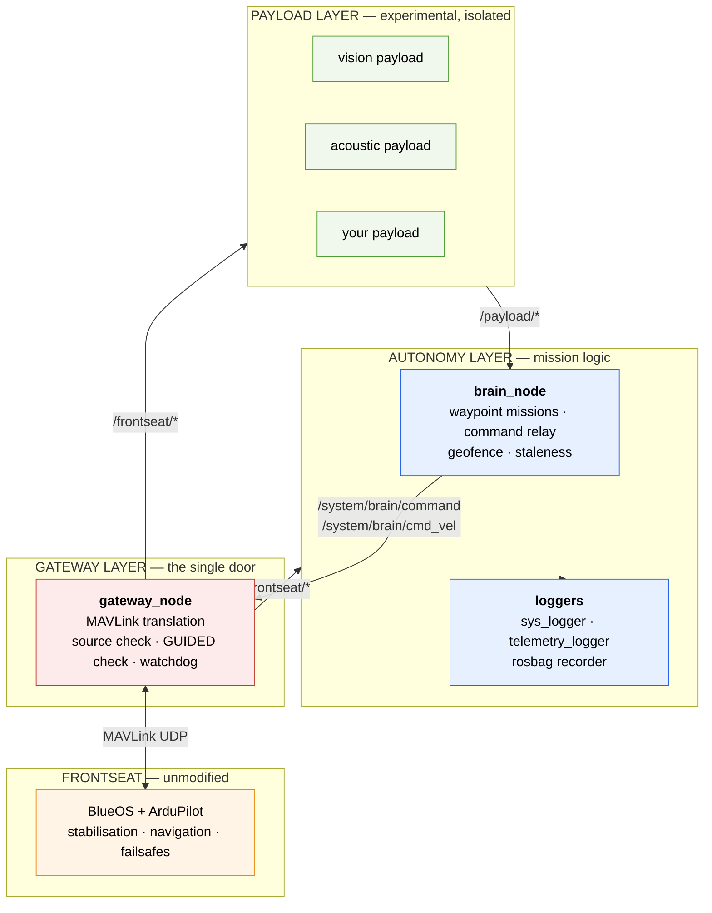

The system is three layers with deliberately narrow interfaces between them. Each layer can fail without taking the layer below it down.

Information flows down and narrows at every step. Payloads produce observations; the brain turns observations into one decision per control cycle; the gateway turns decisions into MAVLink, or refuses to.

## The layers

<AccordionGroup>
  <Accordion title="Frontseat — the vehicle" icon="ship">
    A Navigator flight controller and a Raspberry Pi 4 running BlueOS and ArduPilot (as ArduRover, in skid-steer boat frame).

    It owns everything that keeps the vehicle safe: attitude control, thruster mixing, GPS navigation, RC input, battery and geofence failsafes. It is **not modified** by this project and does not know the backseat exists beyond one more MAVLink endpoint.

    The practical consequence: an operator can fly the boat with QGroundControl exactly as they always did, with the backseat powered off, mid-mission, or crashed.
  </Accordion>

  <Accordion title="Gateway — the single door" icon="door-closed">
    One node, `gateway_node`, holds the MAVLink connection. It translates in both directions:

    - **Down:** ROS 2 `Command` messages into `SET_POSITION_TARGET_GLOBAL_INT`, and `Twist` into body-frame `SET_POSITION_TARGET_LOCAL_NED`.
    - **Up:** GPS, heading, groundspeed, yaw rate, battery, temperature and flight mode into standard ROS 2 messages under `/frontseat/*`.

    It also enforces every authorisation rule in the system. [Details →](/architecture/gateway)
  </Accordion>

  <Accordion title="Autonomy — the decision" icon="brain">
    `brain_node` runs at 10 Hz. Each tick it checks the safety envelope, then either advances a waypoint mission or relays a payload's command — and publishes at most one command.

    Alongside it, `sys_logger_node` reports backseat health and `telemetry_logger_node` writes flat JSONL telemetry. [Details →](/architecture/brain)
  </Accordion>

  <Accordion title="Payloads — the observations" icon="cubes">
    Independent repositories, independent containers, ROS 2 topics only. They read `/frontseat/*` and publish under `/payload/<name>/*`.

    They cannot command the vehicle directly. What they can do is publish to `/payload/waypoints/waypoint` or `/payload/cmd_vel` and let the brain — running in `payload_waypoint` or `payload_velocity` mode — decide whether to act on it. [Details →](/guides/adding-a-payload)
  </Accordion>
</AccordionGroup>

## Everything is a container

Each service is a Docker container on `network_mode: host` and `ipc: host`.

Host IPC is not optional. ROS 2's default DDS middleware uses shared memory for same-machine transport; without a shared IPC namespace, containers either fall back to loopback UDP or fail to discover each other at all. Every container in the system — payloads included — needs it.

The restart policies encode intent. Core autonomy services use `restart: no`:

<Note>
A brain that crashes should stay down. Restarting it silently would restore the autonomy lease and resume commanding a vehicle whose software just proved unreliable. Staying down means the gateway's watchdog fires, the lease is revoked, and the operator gets an unambiguous signal that something is wrong.
</Note>

The Zenoh bridge, which is a monitoring convenience rather than an authority, uses `restart: unless-stopped`.

## Two supervision paths

The vehicle is observable over two independent links, chosen for opposite trade-offs:

| | Foxglove bridge | Zenoh bridge |
|---|---|---|
| **Transport** | WebSocket over WiFi | Zenoh over 4G/LTE |
| **Bandwidth** | High | Low, metered |
| **Range** | Dock, tens of metres | Kilometres offshore |
| **Use** | Debugging, development | Field supervision |
| **Enabled** | Always | `--profile remote` |

Both carry the same topics. The difference is that raw DDS discovery does not survive a cellular NAT, and Zenoh's routed model does.

A third path exists on the vehicles described in the paper: a LoRaWAN module transmitting position, temperature and battery voltage to The Things Network, reaching tens of kilometres at very low power. That is a separate payload rather than part of the core stack, but it is the link that still works when the others do not.

## Design rules

Four rules explain most of the code, and are the ones to preserve when extending it:

<Steps>
  <Step title="One authority">
    Exactly one node commands the vehicle. Everything else is advisory.
  </Step>
  <Step title="The operator wins">
    Backseat software never sets the flight mode. Human authority is enforced by architecture, not by convention.
  </Step>
  <Step title="Fail to the operator, not to a recovery">
    When something breaks, the system stops being an authority and hands the vehicle back. It does not attempt clever autonomous recovery with a component it has just discovered is unreliable.
  </Step>
  <Step title="Experimental code is isolated">
    Research code runs in its own container, in its own repository, behind a topic interface — so that it can be as experimental as it needs to be.
  </Step>
</Steps>

<CardGroup cols={2}>
  <Card title="The gateway in detail" icon="door-closed" href="/architecture/gateway">
    Translation, authorisation and the watchdog.
  </Card>
  <Card title="The brain in detail" icon="brain" href="/architecture/brain">
    Waypoint missions and the command relay.
  </Card>
</CardGroup>
