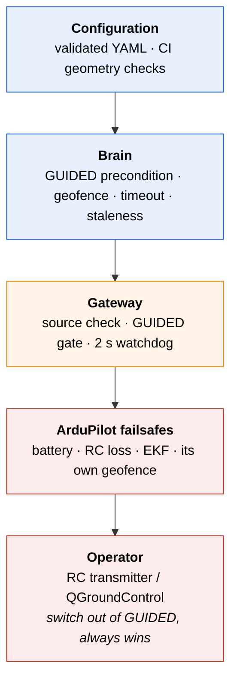

An autonomous boat is a few hundred kilograms of moving equipment carrying instruments worth more than the boat. The safety model is layered so that no single failure — a crashed process, a hung payload, a bad waypoint, a lost link — can produce an uncontrolled vehicle.

## The layers



Read it upward: the further up a protection sits, the less it depends on software that might be the thing that failed. The operator's RC switch depends on nothing in this repository at all.

## Protections in detail

<AccordionGroup>
  <Accordion title="The operator's override" icon="hand">
    **Catches:** anything. Any failure, expected or not.

    The backseat never writes ArduPilot's flight mode. Switching out of GUIDED stops every backseat command from reaching the vehicle within one control cycle, and no state in the brain, the gateway or a payload can prevent it.

    The gateway learns the mode from `HEARTBEAT` telemetry — read, never written. Even the *ability* to change it is absent from the code.
  </Accordion>

  <Accordion title="The GUIDED gate" icon="lock">
    **Catches:** autonomy activating when the operator believes they have manual control.

    Two independent checks, at different times:

    - `brain_node` refuses to start a mission unless `/frontseat/mode` reads GUIDED.
    - `gateway_node` refuses to forward any waypoint or velocity unless the mode is GUIDED *right now*.

    The second matters more. It exists because ArduRover **auto-enters GUIDED** when it receives a `SET_POSITION_TARGET` — without the gate, a backseat command would pull the vehicle out of the operator's chosen mode as a side effect.
  </Accordion>

  <Accordion title="The source check" icon="user-shield">
    **Catches:** a payload commanding the vehicle, whether by mistake or by design.

    ROS 2 topics are visible to every node. The gateway drops any `Command` whose `source_node` is not `core_autonomy`, and logs the rejection loudly enough to find in a bag afterwards.

    Isolation here is by policy rather than by DDS permissions, which keeps payload development simple. The check is what makes the policy real.
  </Accordion>

  <Accordion title="The heartbeat watchdog" icon="heart-pulse">
    **Catches:** a crashed, hung, or starved brain.

    The brain publishes at 10 Hz; two seconds of silence revokes the autonomy lease. From then on, no command is forwarded until the brain recovers and the mode is still GUIDED.

    What it does *not* do is as important: it does not change mode, disarm, or command a return. See [failing safe](#failing-safe-means-failing-to-the-operator) below.
  </Accordion>

  <Accordion title="The geofence" icon="circle-dot">
    **Catches:** a mission, or a payload, driving the boat somewhere it should not go.

    A circular boundary around the mission home, checked every tick in every mode. Two thresholds with hysteresis between them: the strict radius for entering and leaving recovery, and the radius plus a margin for aborting.

    This is the protection that most directly limits what a badly behaved payload can do. In `payload_waypoint`, an algorithm can request any position on Earth and the boat will still not leave the disk.
  </Accordion>

  <Accordion title="The mission timeout" icon="hourglass-half">
    **Catches:** a mission that makes no progress — a waypoint never quite reached, a detection that never comes.

    A wall-clock limit, after which the mission stops and the vehicle returns to the operator. Setting it to 0 disables it, which is why every shipped example sets a real value and a CI test enforces that.
  </Accordion>

  <Accordion title="The staleness check" icon="clock-rotate-left">
    **Catches:** a payload that dies or hangs while driving the boat.

    A payload command older than `payload_command_timeout_sec` is treated as absent. The two payload sources respond differently, deliberately:

    | Mode | On timeout | Why |
    |------|-----------|-----|
    | `payload_waypoint` | hold station at home | A latched waypoint is a destination, not a motion command |
    | `payload_velocity` | publish a zero `Twist` | A latched velocity keeps the boat driving; silence is not a stop |
  </Accordion>

  <Accordion title="ArduPilot's own failsafes" icon="ship">
    **Catches:** everything below the backseat — low battery, RC loss, EKF divergence, its own geofence.

    Unmodified and always active. The backseat cannot disable them, because it cannot write parameters or modes.
  </Accordion>
</AccordionGroup>

## Failing safe means failing to the operator

Every failure path in this system converges on one behaviour: **stop being an authority, and hand the vehicle back**.

The brain drops to MANUAL and stops publishing commands. The gateway revokes the lease and stops forwarding. Neither changes the flight mode, disarms, or attempts a recovery manoeuvre.

<Warning>
An earlier version of this system disarmed the vehicle when the watchdog fired. It seemed prudent. What it actually did was prevent ArduPilot's HOLD mode from applying thruster corrections against wave drift — so a "safety" action produced a boat drifting freely with no mission running and no operator expecting it to move.

Autonomous recovery is a decision. A component that has just failed its own liveness check is the last thing that should be making one.
</Warning>

## Testing the safety model

In simulation, break things on purpose:

<Steps>
  <Step title="Take back control mid-mission">
    ```bash
    ./scripts/sim-set-mode.py MANUAL
    ```
    Commands stop being forwarded immediately, mid-mission, with no cooperation from the brain.
  </Step>

  <Step title="Kill the brain">
    ```bash
    docker stop core_autonomy
    ```
    Within two seconds: `FAILSAFE: Brain Heartbeat Lost! Autonomy lease revoked.`
  </Step>

  <Step title="Shrink the geofence">
    Set `geofence_radius_m` smaller than the waypoint pattern and try to enable autonomy. The mission is refused before it starts, naming how many waypoints fall outside and which is the first.
  </Step>

  <Step title="Starve a payload">
    Run `payload_waypoint`, then stop the payload container mid-mission. The boat should hold station, not continue.
  </Step>
</Steps>

## When extending the system

<Steps>
  <Step title="Never let backseat code set the flight mode">
    This single rule underpins every other protection. Preserve it above all.
  </Step>
  <Step title="Put new autonomy in a payload, not in the brain">
    A payload steering through `payload_waypoint` inherits the geofence, the timeout and the staleness check. Code inside the brain does not automatically.
  </Step>
  <Step title="Check safety before control, not inside it">
    The control loop evaluates the envelope before selecting a mode, so a new mode cannot forget to.
  </Step>
  <Step title="Fail to a stop, never to a manoeuvre">
    When your code does not know what to do, hold station or stop. Do not invent a recovery.
  </Step>
</Steps>
