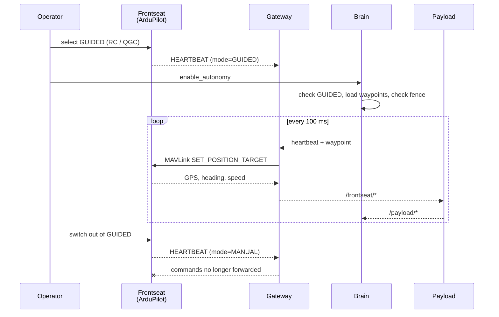

Five ideas explain almost everything about how BlueBoat Core is put together. Read this once and the rest of the documentation will make sense.

## 1. Frontseat and backseat

The vehicle has two computers with strictly separated jobs.

<CardGroup cols={2}>
  <Card title="Frontseat" icon="ship">
    A Navigator flight controller and a Raspberry Pi 4 running BlueOS and ArduPilot. Owns stabilisation, navigation, manual control and hardware failsafes.

    **Unmodified.** Nothing in this project changes it.
  </Card>
  <Card title="Backseat" icon="microchip">
    A Raspberry Pi 5 or NVIDIA Jetson Orin Nano running Ubuntu and ROS 2 Jazzy. Owns mission logic, sensor processing and research code.

    **Everything in this repository runs here.**
  </Card>
</CardGroup>

The split is not an implementation detail, it is the safety argument. Experimental code cannot destabilise the vehicle because it does not run on the computer that stabilises the vehicle. The standard BlueOS workflow — QGroundControl, manual missions, RC control — keeps working exactly as before, whether or not the backseat is even powered on.

This pattern comes from [MOOS-IvP](https://oceanai.mit.edu/moos-ivp/) and MBARI's long-range AUVs, where the same reasoning applies at much higher cost.

## 2. The gateway is the only door

Exactly one node holds a MAVLink connection to the autopilot: `gateway_node`.

Every other node in the system — including the brain, and including every payload — influences the vehicle only by publishing a ROS 2 message that the gateway chooses to forward. The gateway enforces three rules before anything reaches the autopilot:

<Steps>
  <Step title="The sender must be authorised">
    A `Command` message whose `source_node` is not `core_autonomy` is logged and dropped. Payloads can see the topic; they cannot use it.
  </Step>
  <Step title="The vehicle must be in GUIDED">
    The gateway reads ArduPilot's mode from telemetry. Outside GUIDED, no waypoint and no velocity is forwarded.
  </Step>
  <Step title="The autonomy must be alive">
    The brain heartbeats at 10 Hz. Two seconds of silence and the gateway revokes the autonomy lease.
  </Step>
</Steps>

[How the gateway works →](/architecture/gateway)

## 3. The operator keeps flight-mode authority

The backseat **never** writes ArduPilot's flight mode. Not at startup, not to recover from an error, not to complete a mission.

GUIDED is selected by a human — on the RC transmitter, or in QGroundControl. That single decision is what enables autonomous operation, and reversing it disables autonomy instantly and unconditionally, no matter what the backseat believes it is doing.

<Warning>
This is the property to preserve above all others when you extend the system. Any change that lets backseat code set the flight mode removes the operator's guaranteed override.
</Warning>

## 4. Nothing moves until you ask twice

Autonomous operation needs two independent acts, by a human:

<Steps>
  <Step title="Select GUIDED">
    On the RC transmitter or in the ground station. This tells the autopilot that a backseat may command it.
  </Step>
  <Step title="Enable relaying">
    ```bash
    ros2 service call /system/enable_autonomy std_srvs/srv/SetBool "{data: true}"
    ```

    This tells the brain to actually do so.
  </Step>
</Steps>

Requiring both is deliberate. GUIDED alone may mean the operator intends to drive the boat themselves from a ground station, and a payload publishing waypoints would otherwise take over silently. Leaving GUIDED clears the enable flag too, so returning to it later never resumes something you have stopped thinking about.

## 5. Payloads are separate repositories

A payload is a sensor driver, a perception model, a planner — anything that is not core autonomy. Each one:

- lives in **its own git repository**, generated from the [payload template](https://github.com/BlueLab-ICM/blueboat-payload-template),
- runs in **its own container**, built independently,
- communicates **only over ROS 2 topics**, reading `/frontseat/*` and publishing under `/payload/<name>/*`.

Nothing about a payload can break the autonomy. A payload that crashes disappears from the topic graph; a payload that hangs stops publishing and the brain's staleness check stops the boat; a payload that saturates the CPU is competing with an autonomy loop that needs very little of it.

This is also what makes collaboration practical: a visiting researcher gets a repository, not commit access to the vehicle's autonomy.

[Adding a payload →](/guides/adding-a-payload)

## How they fit together



<Card title="Next: run it yourself" icon="play" href="/getting-started/simulation">
  A complete autonomous mission in simulation, on your laptop.
</Card>
