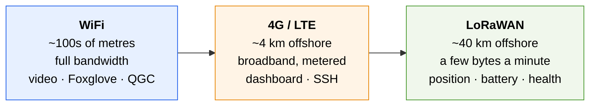

A stock BlueBoat has one link: WiFi, good for a few hundred metres in ideal conditions. That is a hard constraint on where the boat can go, because it is also the constraint on where the operator can still see it.

The platform adds two more. They are not redundant copies of the same channel; each one answers a different question about what still works at a given distance.



As range grows, bandwidth collapses. The design consequence is that each link carries a different thing, and the system stays useful as the boat moves out of range of the richer ones.

## WiFi

The baseline link, unchanged from the stock vehicle. QGroundControl, SSH, the Foxglove bridge and camera streams all run over it.

Use it for everything at the dock and during development. Its range is the reason the other two exist.

## 4G / LTE

A cellular modem (the paper's vehicles use a Lantronix X304) on the onboard network gives broadband connectivity to roughly 4 km offshore, depending on coverage.

This is what makes Internet-based supervision possible: an operator anywhere with a browser can watch the vehicle and issue high-level commands, with no line of sight and no local ground station.

<AccordionGroup>
  <Accordion title="Why Zenoh rather than plain DDS" icon="network-wired">
    ROS 2's default DDS discovery relies on multicast and direct peer addressing. Neither survives a cellular network's NAT.

    The Zenoh bridge (`eclipse/zenoh-bridge-ros2dds`) republishes the ROS 2 topics over a routed protocol that does traverse NAT, which is what carries the full vehicle state to a remote dashboard.

    ```bash
    docker compose -f deployment/docker-compose.yml --profile remote up -d
    ```

    It is off by default because it is wasted bandwidth on a bench test.
  </Accordion>

  <Accordion title="Watch the data budget" icon="gauge-high">
    Cellular is metered and the bridge will happily carry everything published. Exclude high-rate topics — camera streams above all — from what crosses it, and prefer the recorded JSONL telemetry over live raw topics for anything that can wait until the boat is back.
  </Accordion>

  <Accordion title="A remote-access VPN helps" icon="lock">
    Cellular addresses are usually behind carrier NAT, so nothing can connect *to* the boat. An overlay network such as Tailscale or WireGuard gives a stable address for SSH regardless of which network the boat is on, which is the difference between debugging a payload offshore and waiting for the boat to come back.
  </Accordion>
</AccordionGroup>

## LoRaWAN

A LoRaWAN module (the paper's vehicles use a Seeed Studio Wio-E5-LE) reaching tens of kilometres offshore at very low power. The trade is severe: a few bytes every few minutes.

That is enough for the only question that matters when everything else has failed — *where is the boat, and is it alive?*

<Steps>
  <Step title="Provision the device">
    Assign DevEUI and AppEUI, choose Class A, set the data rate, and use OTAA activation. Join with `AT+JOIN`.
  </Step>
  <Step title="Register on a network">
    [The Things Network](https://www.thethingsnetwork.org/) on EU868, or your regional band.
  </Step>
  <Step title="Decode the payload">
    A decoder in TTN turns the packed bytes into fields: GPS position, internal temperatures, battery voltage.
  </Step>
  <Step title="Receive it">
    TTN delivers to a backend over HTTP webhooks. The reference implementation is a Node.js server storing to SQLite, exposing a REST API for history and WebSockets for live updates.

    <Note>
    Webhooks rather than MQTT, because MQTT was blocked by network restrictions at the deployment site. Worth knowing before you design around MQTT and discover the same thing on a jetty.
    </Note>
  </Step>
</Steps>

Pack the payload tightly. At these data rates, sending a float as text instead of a scaled integer is a real cost.

## Choosing what goes where

| | WiFi | 4G/LTE | LoRaWAN |
|---|---|---|---|
| Camera streams | ✅ | ❌ | ❌ |
| Full ROS 2 telemetry | ✅ | ⚠️ metered | ❌ |
| Mission commands | ✅ | ✅ | ❌ |
| Position, battery, health | ✅ | ✅ | ✅ |
| SSH | ✅ | ✅ | ❌ |
| Works at 20 km | ❌ | ❌ | ✅ |

A useful way to design a deployment: assume each link will fail in range order, and check that the boat is still supervisable and recoverable after each one does.

## Related

<CardGroup cols={2}>
  <Card title="Monitoring" icon="chart-line" href="/guides/monitoring">
    What to watch during a mission, over which link.
  </Card>
  <Card title="Hardware overview" icon="screwdriver-wrench" href="/hardware/overview">
    Where the modems and antennas physically go.
  </Card>
</CardGroup>
