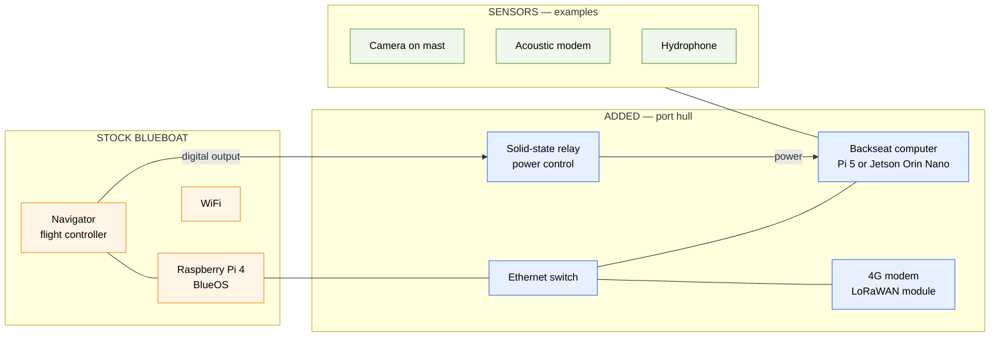

The BlueBoat ships as a capable remotely operated survey vehicle. Turning it into an adaptive research platform takes four additions, all fitted inside the port hull and all reversible.

<CardGroup cols={2}>
  <Card title="Backseat computer" icon="microchip" href="/hardware/backseat-computer">
    The second computer, its power control, and how it joins the onboard network.
  </Card>
  <Card title="Communications" icon="tower-broadcast" href="/hardware/communications">
    WiFi, 4G/LTE and LoRaWAN — three links with very different ranges.
  </Card>
  <Card title="Sensors" icon="camera" href="/hardware/sensors">
    Camera, acoustic modem and hydrophone, and how to integrate your own.
  </Card>
  <Card title="First mission" icon="ship" href="/getting-started/on-the-vehicle">
    Software setup once the hardware is in.
  </Card>
</CardGroup>

## The four additions

<AccordionGroup>
  <Accordion title="A backseat computer" icon="microchip">
    A Raspberry Pi 5 or an NVIDIA Jetson Orin Nano, joined to the onboard network through an Ethernet switch. This is where ROS 2 and all research code runs.

    The choice between them is a power-for-compute trade:

    | | Raspberry Pi 5 | Jetson Orin Nano |
    |---|---|---|
    | Power | 4-12 W | up to 25 W |
    | YOLO inference | ~1 Hz | >5 Hz |
    | Suits | sensing, communications, logging | vision, learned policies |

    At 1 Hz a detector can confirm a target; it cannot close a control loop around one. That difference is what decides the board, and it costs roughly double the power.
  </Accordion>

  <Accordion title="Relay-controlled power" icon="bolt">
    The backseat is powered through a solid-state relay driven by a digital output on the flight controller.

    Two reasons, both operational rather than electrical:

    - **Endurance.** A mission that needs no autonomy runs with the backseat off, saving up to 25 W over a long deployment.
    - **Recovery.** A backseat that has locked up can be power-cycled from the ground station, over whatever link still works. Without it, a software hang means recovering the boat.
  </Accordion>

  <Accordion title="Long-range communications" icon="tower-broadcast">
    A 4G/LTE modem for broadband out to a few kilometres offshore, and a LoRaWAN module for low-power telemetry out to tens of kilometres.

    They are not alternatives to WiFi so much as different answers to "what still works at this distance". [More →](/hardware/communications)
  </Accordion>

  <Accordion title="Sensor payloads" icon="camera">
    Whatever the science needs. The platform has carried a global-shutter machine-vision camera on a mast, an acoustic modem for communication with seafloor instruments, and a broadband hydrophone for passive acoustic monitoring.

    These are examples, not requirements. Integration is through USB, Ethernet, or serial via RS232-to-USB. [More →](/hardware/sensors)
  </Accordion>
</AccordionGroup>

## Mechanical integration

Everything fits in the port hull on a custom 3D-printed bracket carrying the backseat computer, the Ethernet switch, the 4G modem and the LoRaWAN module. The starboard hull is untouched.

Six TNC coaxial connectors in the port-hull cover bring antenna feeds out to the deck, with a printed guard over them — bulkhead connectors on a boat that gets manhandled onto a trailer need protecting from the trailer, not from the sea.

<Note>
The mechanical designs and electrical schematics are released as open-source resources alongside the paper. See the [organisation's repositories](https://github.com/orgs/BlueLab-ICM/repositories).
</Note>

## Power budget

| Component | Draw |
|-----------|------|
| Stock BlueBoat (idle, WiFi) | baseline |
| Raspberry Pi 5 backseat | 4-12 W |
| Jetson Orin Nano backseat | up to 25 W |
| 4G modem | 2-5 W |
| LoRaWAN module | < 0.1 W average |
| Camera | 2-3 W |

On a long deployment the backseat is the largest single addition, which is what makes the relay worth the wiring.

## What this does not change

Worth stating plainly: none of it modifies the vehicle's own control system.

The Navigator, BlueOS, ArduPilot, the thrusters, the RC link and the standard QGroundControl workflow all behave exactly as they did before. Disconnect the backseat and you have a stock BlueBoat again — which is the property that makes it reasonable to run experimental code on a boat you care about.
