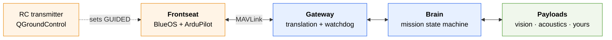

BlueBoat Core turns a stock [Blue Robotics BlueBoat](https://bluerobotics.com/store/rovs-components/blueboat/) into a research platform that can decide things for itself.

It does that by adding a second computer. The vehicle's own BlueOS and ArduPilot stack — the **frontseat** — keeps doing what it is good at: stabilisation, navigation, manual control, hardware failsafes. A **backseat** computer running ROS 2 handles everything above that: mission logic, sensor processing, and whatever research code you bring. A single MAVLink gateway joins them, and nothing in the backseat can move the vehicle except through it.

<Note>
This documentation accompanies the OCEANS 2026 Monterey paper *An adaptive open-source architecture for enhanced autonomy in BlueBoat ASVs based on ROS2*, from the [BLUE Lab](https://bluelab.icm.csic.es/) at ICM-CSIC, Barcelona.
</Note>

## Start here

<CardGroup cols={2}>
  <Card title="Run it in simulation" icon="play" href="/getting-started/simulation">
    A full waypoint mission on your laptop. No vehicle, no autopilot hardware.
  </Card>
  <Card title="Core concepts" icon="lightbulb" href="/getting-started/concepts">
    Frontseat and backseat, the gateway, payloads, and who is allowed to command what.
  </Card>
  <Card title="Add your own payload" icon="puzzle-piece" href="/guides/adding-a-payload">
    Build an algorithm that steers the boat, without touching the core stack.
  </Card>
  <Card title="Set up the hardware" icon="screwdriver-wrench" href="/hardware/overview">
    The backseat computer, power control, communications and sensors.
  </Card>
</CardGroup>

## What you get

<AccordionGroup>
  <Accordion title="Autonomy that cannot override the operator" icon="shield-halved">
    The backseat never writes ArduPilot's flight mode. Autonomous commands are forwarded only while the operator has selected GUIDED on the RC transmitter or in the ground station, and a watchdog revokes that authority within two seconds if the autonomy stops responding. Taking back control is a switch flip.

    [How the safety model works →](/architecture/safety)
  </Accordion>

  <Accordion title="Waypoint missions, with nothing to write" icon="route">
    Point the brain at a JSON waypoint file and it flies the survey. Two pattern generators ship — lawnmower for uniform coverage, spiral for searching outward from a believed position.

    [Waypoint missions →](/guides/waypoint-missions)
  </Accordion>

  <Accordion title="Payloads that cannot break the vehicle" icon="cubes">
    Each payload is a separate repository and a separate container, communicating only over ROS 2 topics. A payload that crashes, hangs or saturates the CPU cannot take the autonomy down with it.

    [Adding a payload →](/guides/adding-a-payload)
  </Accordion>

  <Accordion title="Mission data you can actually analyse" icon="chart-line">
    A complete MCAP rosbag of every topic, plus flat JSONL telemetry that loads straight into pandas without a ROS installation anywhere near it.

    [Data and logging →](/guides/data-logging)
  </Accordion>
</AccordionGroup>

## The shape of the system



The frontseat is unmodified. The gateway is the only node with a MAVLink connection and the only one permitted to command the vehicle. The brain decides where to go. Payloads observe and suggest, and the brain decides whether to act on them.

[The full architecture →](/architecture/overview)

## Two repositories

<CardGroup cols={2}>
  <Card title="blueboat-core-public" icon="github" href="https://github.com/BlueLab-ICM/blueboat-core-public">
    The autonomy stack. Gateway, brain, waypoint missions, simulation.
  </Card>
  <Card title="blueboat-payload-template" icon="github" href="https://github.com/BlueLab-ICM/blueboat-payload-template">
    A template repository for your own payload. Use it to start a sensor driver or an algorithm.
  </Card>
</CardGroup>

## Citing this work

```bibtex
@inproceedings{masmitja2026blueboat,
  title     = {An adaptive open-source architecture for enhanced autonomy
               in {BlueBoat} {ASVs} based on {ROS2}},
  author    = {Masmitja, Ivan and Somers, Korneel and Agundez, Pedro and
               Pradell, Roc and Bardaji, Raul and Carandell, Matias and
               Aguzzi, Jacopo and Gomariz, Spartacus},
  booktitle = {OCEANS 2026 Monterey},
  year      = {2026}
}
```
